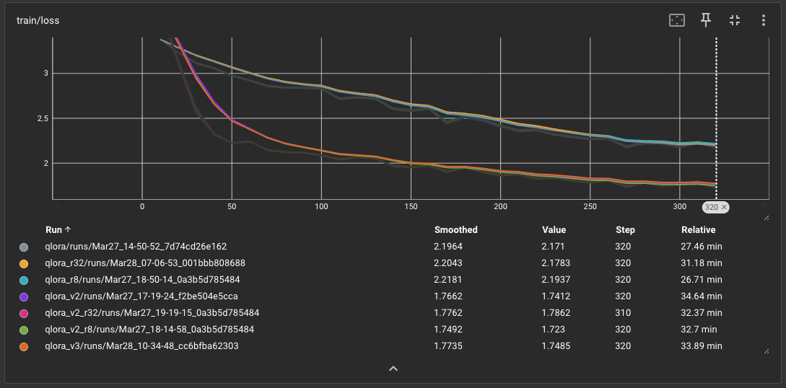
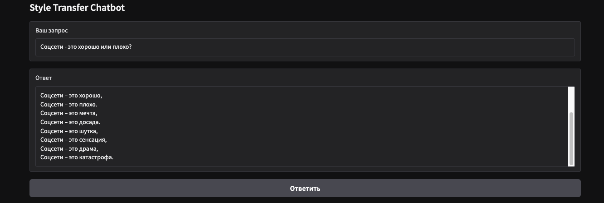

# Задачи генерации NLP
## Домашнее задание 2: Fine-Tuning LLM для стилизации персонажа
### Присяжнюк Артем

## Структура репозитория
- config/config.yaml - пример файла конфигурации для обучения
- data/train.jsonl - данные, использованные для обучения
- src/
    - app.py - скрипт запуска приложения на gradio
    - inference.py - функционал, необходимый для запуска
    - preprocess.py - разметка и препроцессинг данных (для разметки необходим ключ aitunnel в .env)
    - train_sft.py - скрипт обучения модели
- checkpoints.zip - архив с моделями
- requirements.txt - файл с зависимостями

## Инструкции по запуску
- Создайте виртуальное окружение при помощи venv, conda или аналогов
- Загрузить чекпоинт по ссылке и распаковать `https://drive.google.com/file/d/1r2WF7zQIn1QqONswcX8zBVcGGURVrbz7/view?usp=sharing`
- (опционально) создайте .env и заведите туда API_KEY с ключом aitunnel для разметки данных
- Установите необходимые зависимости в файле requirements.txt
- Распакуйте папку checkpoints с моделями из архива checkpoints.zip
- Зайдите в папку src/
- Запустите приложение командой `python app.py --checkpoints-path ../checkpoints --checkpoint qlora_v3 --config-path ../config --config config.yaml`
- Задайте любой вопрос

# Отчет
### Данные
Для обучения был использован датасет со стихотворениями русских поэтов "AnyaSchen/russian_poetry_with_keywords".
Для создания QA датасета с парами вопрос-ответ был использован api сервиса aitunnel. 
Таким образом, для каждого стихотворения был сгенерирован вопрос, 500 пар вопрос-ответ.

### Обучение
За основу была взята модель Qwen3-4B-Instruct.
Было обучено три варианта QLoRA адаптера: 
1. Просто на поэтический текст (qlora)
2. На чат-шаблон с запросом пользователя вида "Автор: Пушкин Тема: В чем смысл жизни?" (qlora_v2)
3. На чат-шаблон с поэтическим текстом (qlora_v3)

Для qlora и qlora_v2 были обучены варианты LoRA r=8/16/32, для qlora_v3 только r=16 как стандартный и эффективный. В вариантах чат-шаблон использовался системный промпт: "Ты полезный ассистент и помогаешь отвечать на разные вопросы. Отвечай в 1-2 предложения." Обучение для всех представлено на графике. 

  

Сходимость всех моделей практически совпадает, и увеличение ранга LoRA (r=8/16/32) не дает заметного улучшения, что, вероятно, связано с относительно простой задачей стилизации (базовая модель 4B уже умеет стилиховать по инструкции) и ограниченным разнообразием данных (только 500 примеров), из-за чего даже малые адаптеры быстро достигают насыщения. При этом формат обучения влияет значительно сильнее: базовый вариант на поэтическом тексте показывает худший loss, тогда как добавление чат-шаблона с явным вопросом, qlora_v2, дает наилучший результат, поскольку модель одновременно учится отвечать на запрос и соблюдать стиль. Вариант qlora_v3 близок к нему, но не превосходит, что указывает на важность явной связки «вопрос–ответ», а не только форматирования в чат.
Тем не менее, вариант qlora_v2 требует специального префикса в сообщении пользователя, в то время как qlora и qlora_v3 нативно стилизуют ответы.

### Анализ результатов
Для анализа результатов были использованы r=16 версии моделей и базовая модель с (base_prompt) и без добавления инструкции (base). 

**base:** даёт стабильные, содержательные ответы без стиля. Полностью корректен, но не решает задачу стилизации.

**base_prompt:** появляется поэтический стиль, но качество резко падает: повторы, зацикливание, деградация текста. Инструкция не даёт устойчивого контроля.

**qlora:** частично учит стиль, но нестабильно: либо слишком коротко и пусто, либо уходит в длинные зацикленные тексты. Связка с задачей слабая.

**qlora_v2:** хорошо держит формат QA и даёт аккуратные ответы, но почти теряет поэтический стиль и иногда отказывается отвечать. Стиль подавлен шаблоном.

**qlora_v3:** лучше всего передаёт поэтический стиль, но есть проблемы с контролем (повторы, артефакты). Тем не менее, это наиболее близкий вариант к целевой задаче.

**Итог:** среди обученных моделей qlora_v3 лучший по стилю, несмотря на шум. В сравнении с base_prompt он даёт более осмысленные и структурированные ответы, тогда как base_prompt лишь поверхностно имитирует стиль и быстрее деградирует.

| Вопрос | base (до) | qlora_v3 (после) |
|--------|------|----------|
| В чем смысл жизни? | Смысл жизни — это вопрос, на который нет однозначного ответа и он зависит от ценностей человека. | Смысл жизни?.. ну, что ж, не знал? Во что ж он вложил свой дух? Во что ж он вложил свои Сокровенные мечты? Во что ж он вложил свои Сокровенные годы? |
| Что такое любовь? | Любовь — это чувство привязанности, заботы и эмоциональной близости. | Любовь – это нечто, что не может быть Описано ни словами, ни мыслью. Она не может быть измерена, Не может быть изображена в рисунке. |
| Что такое искусственный интеллект? | Искусственный интеллект — это технологии, позволяющие машинам выполнять задачи, требующие интеллекта. | Искусственный интеллект — это способность Имитировать разумные действия И, в особенности, мышление. — Это, в частности, Способность к обучению |

### Примеры работы
Интерфейс построен на основе gradio и принимает вопрос, на который выдает поэтический ответ модели.

  

